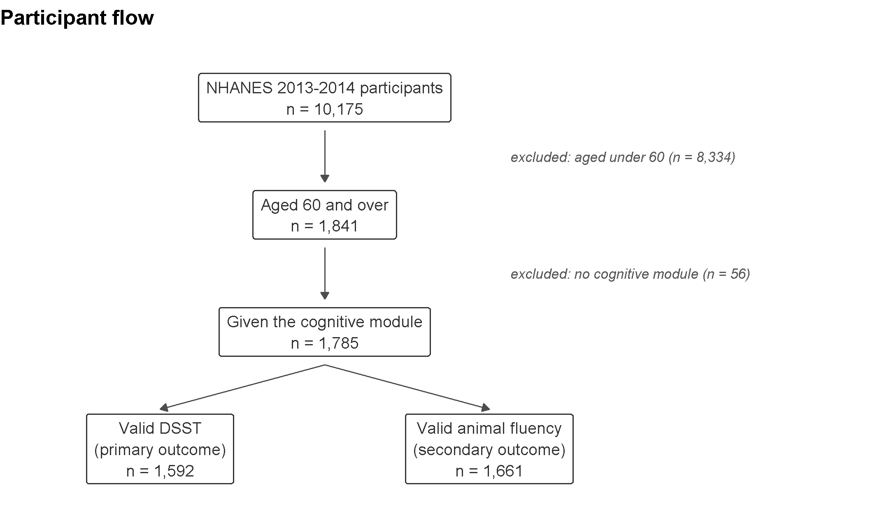
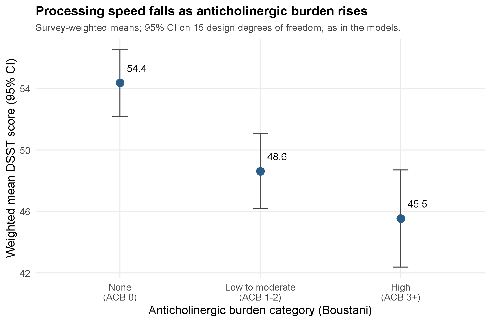
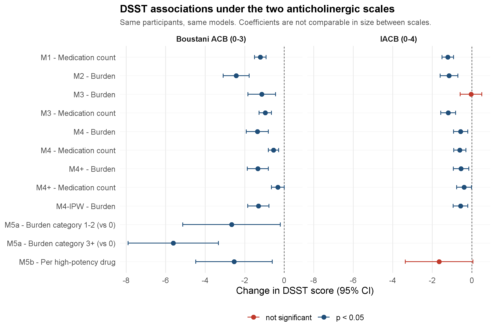
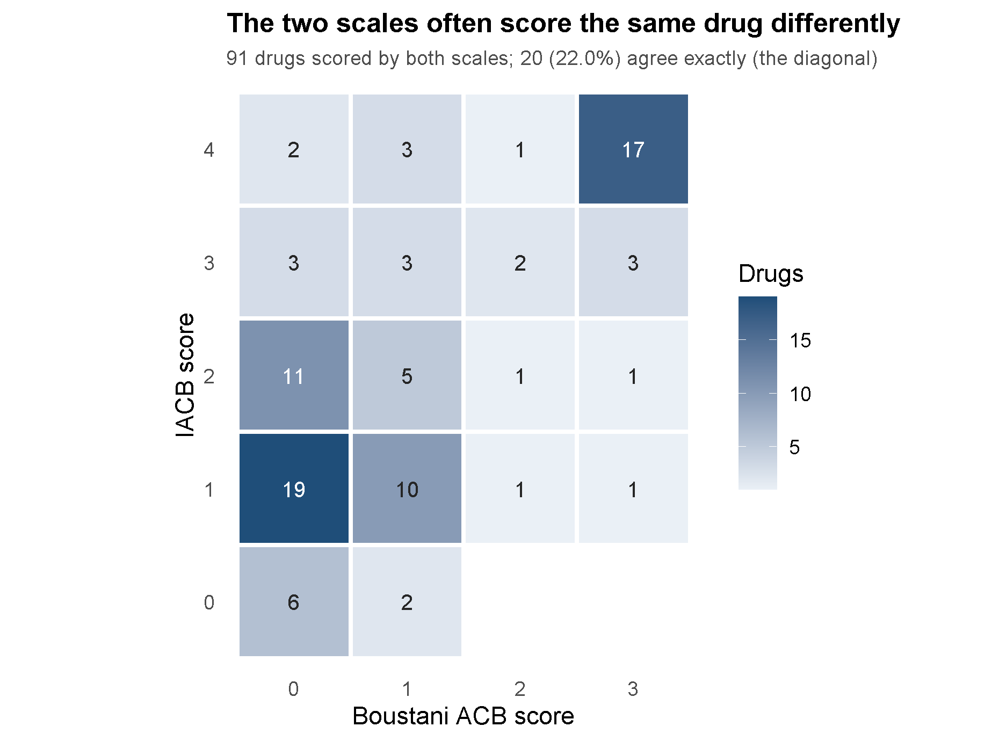
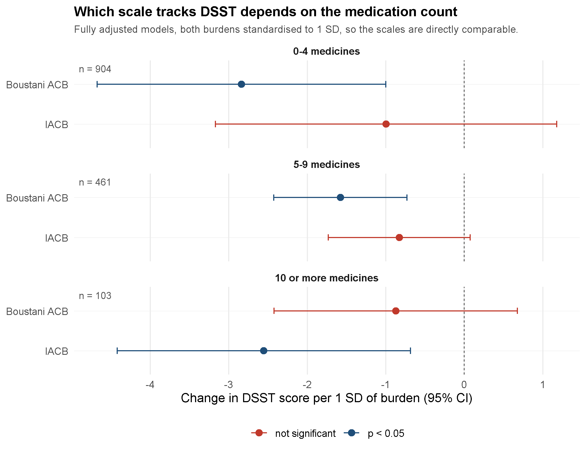

<!--
SOURCE OF TRUTH for the dissertation draft. Rendered to .docx by build_docx.py.
Status: COMPLETE DRAFT (Title, Abstract, Intro, Methods, Results, Discussion,
Conclusion, References). All 19 references verified against PubMed/publisher records
on 16 Jul 2026 - none fabricated. UK spelling. Causal language kept associational.
Outstanding: student registration number; final word count; Turnitin check.
-->

# TITLE PAGE

**Is anticholinergic burden associated with cognition independently of polypharmacy? A survey-weighted cross-sectional analysis in older US adults (NHANES 2013–2014)**

Jigneshbhai Siddhapura

[Student registration number]

Module: BIO-7057X Dissertation
Supervisor: Dr Saber Sami
Module Organiser: Karl Grieshop
Submission: [date] (deadline 7 August 2026)
Word count (main text): 7,999

(Includes in-text citations. Excludes the title page, table contents, table titles, figure legends, the reference list and the appendix, as specified in the assessment brief. Word's whole-document count, which includes all of those, is 10,243.)

---

# ABSTRACT

**Background.** Older adults are commonly prescribed medicines with anticholinergic activity, which may impair cognition. Because people taking these drugs also tend to take more medicines overall, the effect of anticholinergic burden (ACB) is easily confused with that of polypharmacy. This study tested whether ACB is associated with cognition independently of the number of medicines taken, and whether the answer depends on the scale used to score it.

**Methods.** Cross-sectional analysis of the 2013–2014 National Health and Nutrition Examination Survey (NHANES), restricted to adults aged 60 and over. Of 1,785 age-eligible participants, 1,592 had valid Digit Symbol Substitution Test (DSST) data and formed the primary sample; animal fluency (n=1,661) was secondary. Drug names were scored through an explicit crosswalk that splits combination products and keeps the score of every component a list recognises. Survey-weighted linear regression adjusted progressively for medication count, demographic and socioeconomic covariates, and comorbidities, with the fully adjusted model refitted on the comorbidity-model participants so the two were directly comparable. Sensitivity analyses used inverse-probability weighting (IPW) for informative missingness, excluded prior stroke, and rescored burden on the International Anticholinergic Burden (IACB) scale. Both burdens were standardised to one standard deviation and compared on effect size and change in model fit, overall and within medication-count strata.

**Results.** Weighted mean DSST fell across ACB categories (54.4, 48.6, 45.5). Fully adjusted, each ACB point was associated with a 1.37-point lower DSST score (95% CI −1.92 to −0.81; p<0.001), about 1.6 years of ageing in the same model, and ACB 3+ with a 5.62-point deficit (p<0.001). ACB was stable under IPW (−1.31) and stroke exclusion (−1.23). On identical participants, adding comorbidities left burden unchanged under both scales while cutting medication count by a third or more. The scales agreed exactly on only 22.0% of the drugs they both score, yet standardised to 1 SD both were associated with DSST (Boustani −1.98, p<0.001; IACB −1.29, p=0.005) and both improved model fit (ΔAIC −21.9 and −8.0). Stratifying by medication count separated them: Boustani burden was associated with DSST at 0–4 and 5–9 medicines, IACB only at 10 or more (−2.55 per SD; p=0.011; ΔAIC −9.1). Fluency associations were weaker under both.

**Conclusion.** Higher anticholinergic burden was associated with poorer processing speed, robustly to comorbidity adjustment, informative missingness and stroke exclusion, and under both instruments it carried information a medication count did not. The scales were not interchangeable, however: each detected the association in a different part of the medication-count range. Conclusions about anticholinergic burden therefore cannot be separated from the instrument used to measure it, or from how heavily medicated the population is.

---

# 1. INTRODUCTION

## 1.1 Cognitive decline in an ageing population

The populations of most high-income countries are growing older, and a larger number of older adults means a larger number living with reduced cognitive function. Late-life cognitive impairment is not a single condition; it runs from a mild slowing of thought and difficulty concentrating through to dementia, and it shapes independence, safety and quality of life long before any formal diagnosis is made (Livingston et al., 2024). Much of the research effort has gone into risk factors that cannot be changed, such as age and genetic susceptibility. Yet some of the cognitive difficulty seen in older people is iatrogenic: produced, or worsened, by the medicines meant to treat their other conditions. That part matters here for one reason above all. Unlike age or genotype, it can in principle be changed.

Processing speed is central to this picture. It is among the first abilities to decline with age, and a slowing there feeds into memory, reasoning and everyday tasks such as driving or managing money (Salthouse, 1996). A factor that measurably slows processing in older adults is worth identifying, all the more so if it can be acted upon.

## 1.2 Anticholinergic medicines and the ageing brain

Acetylcholine is a neurotransmitter closely tied to attention, to the speed at which information is processed, and to memory. Many routinely prescribed drugs block its action as an unintended side effect rather than their main purpose: some antidepressants, bladder antimuscarinics, first-generation antihistamines and several cardiovascular and gastrointestinal agents all carry this anticholinergic activity (Ruxton, Woodman and Mangoni, 2015). In a healthy younger adult the cognitive cost is usually small and passes when the drug is stopped. Older adults are more exposed on every front. They are prescribed more of these medicines, metabolise and clear them more slowly, the blood–brain barrier grows more permeable with age, and the cholinergic system is already in decline, so the same drug can carry a heavier cost in an eighty-year-old than a thirty-year-old. Observational work has reported associations between greater anticholinergic exposure and both poorer cognitive performance and higher long-term dementia risk in older people (Gray et al., 2015; Coupland et al., 2019; Pieper et al., 2020), and the concern is serious enough that these drugs feature prominently on prescribing-safety lists (American Geriatrics Society Beers Criteria Update Expert Panel, 2023).

Anticholinergic exposure is often described as a modifiable risk factor, on the reasoning that a drug effect, unlike the fixed pathology of dementia, should ease once the medicine is withdrawn. That is plausible but not established. A Cochrane review of anticholinergic deprescribing interventions located only three randomised trials, between them enrolling 299 participants, and judged the evidence too weak to say whether lowering burden benefits cognition at all (Taylor-Rowan et al., 2023). Some observational evidence points the other way: Gray et al. (2015) reported that dementia risk associated with cumulative exposure appeared to persist rather than resolve after the drugs were stopped. The reversibility question therefore remains open and this cross-sectional study cannot address it. What it can ask is whether higher burden is associated with poorer cognition at a single point in time, a precondition for that question rather than an answer to it.

## 1.3 Burden versus count

Not all anticholinergic exposure is equal. Two people may each take a single anticholinergic drug and yet carry very different pharmacological loads, because drugs differ in how strongly they act on the cholinergic system. To capture this, researchers weight each medicine by the strength of its action and sum those weights across everything a person takes, producing an anticholinergic burden (ACB) score. The primary scale used here is that of Boustani et al. (2008), scoring each drug 0 to 3, with 3 marking the drugs of greatest concern.

Burden needs to be held apart from a second, simpler idea: polypharmacy, the number of medicines a person takes at once, often defined as five or more (Masnoon et al., 2017). The two are easy to confuse because they travel together. Someone taking many medicines is, almost by arithmetic, more likely to be taking at least one with anticholinergic activity, so ACB and drug count are strongly correlated in practice. If people on more anticholinergic drugs have poorer cognition, is that because of the specifically anticholinergic character of their medicines, or simply because they take more in total, itself a marker of being less well? A study measuring only one of the two cannot separate them, and the distinction is not academic: it decides whether the actionable target is the *type* of drug or the *number*.

A further difficulty is that the reasons people are given anticholinergic drugs (depression, incontinence, poor sleep, chronic illness) may themselves bear on cognition, so part of any association could reflect the conditions being treated rather than the medicines. Adjustment cannot remove this but can narrow it, a further reason to model burden and count together and alongside demographic and socioeconomic factors.

## 1.4 What is known, and the gap this study addresses

The closest recent work is Mur et al. (2025), who compared anticholinergic drug use with polypharmacy as predictors of death, dementia and delirium in the UK Biobank cohort, deriving exposure by averaging prescription records over as much as ten years. Their longitudinal design is a strength a single-cycle survey cannot match. Two features of the wider literature nonetheless leave room for the analysis reported here. First, studies frequently examine anticholinergic burden without placing it in the same model as drug count, so the "beyond polypharmacy" question often goes unanswered directly. Second, when nationally representative survey data are used the complex sampling design is not always handled correctly, and treating a multistage, unequally weighted probability sample as a simple random sample distorts both the estimates and their confidence intervals (Lumley, 2010).

This dissertation addresses that gap in a nationally representative US sample, using the 2013–2014 cycle of NHANES, which unusually records both prescription medications and cognitive test scores for the same participants, so drugs and cognition can be linked at the level of the individual.

NHANES is not a convenience sample. It follows a complex, multistage probability design with deliberate oversampling and supplied weights, so results generalise to the non-institutionalised US population, and those same features mean the weights, primary sampling units and strata must enter the models or both estimates and standard errors will be misstated. Handling NHANES correctly is therefore part of the contribution here, not a technical afterthought. The trade-off is that the survey captures medicines and cognition at a single visit, so the burden measured is a snapshot rather than years of accumulated exposure, a point the discussion returns to. Within these bounds, the analysis places burden and drug count together in survey-weighted regression models, so the contribution of each can be read while holding the other constant.

## 1.5 Aims, research questions and hypotheses

The overall aim is to determine whether anticholinergic burden is associated with cognitive performance in community-dwelling adults aged 60 and over, independently of polypharmacy. The specific research questions are:

- **RQ1.** Is anticholinergic burden associated with processing speed, measured by the DSST, after accounting for the number of prescription medicines?
- **RQ2.** Does anticholinergic burden add explanatory value beyond drug count? In other words, does its association survive when drug count is included in the same model?
- **RQ3.** Does any association extend to a second cognitive domain, verbal (animal) fluency?
- **RQ4.** Is there a dose–response relationship across ACB categories (0, 1–2 and 3+), and specifically for high-potency (score-3) anticholinergics?
- **RQ5.** Do the answers to RQ1 and RQ2 depend on which published scale is used to score burden, and if so, in which participants?

The corresponding hypotheses are that higher burden is associated with lower DSST scores after adjustment (H1), and that this persists with drug count in the model (H2); the null hypothesis (H0) is that burden has no association with cognition independent of drug count. The DSST was chosen as the primary outcome because anticholinergic drugs act principally on attention and processing speed, which is what it measures (Jaeger, 2018); animal fluency captures a related but distinct domain. The design is cross-sectional and observational throughout, and the language of association rather than prediction or causation is deliberate: the analysis can show whether burden and cognition move together, not whether reducing burden would improve cognition. Even within that limit, establishing whether burden carries information beyond drug count decides whether anticholinergic prescribing is worth singling out at all.

The chapter that follows sets out the NHANES data, the derivation of the exposure and outcome variables, and the survey-weighted models used to answer these questions.

---

# 2. MATERIALS & METHODS

## 2.1 Data source and study sample

The analysis used the 2013–2014 cycle of the National Health and Nutrition Examination Survey (NHANES), a programme of the US National Center for Health Statistics (NCHS) that surveys the civilian, non-institutionalised population through a home interview and a standardised health examination (National Center for Health Statistics, 2018). NHANES uses a complex, multistage probability design and publishes sampling weights, primary sampling units and strata so estimates can be generalised to the US population. Three public-use files were linked on the respondent identifier (SEQN): demographics (DEMO_H), prescription medications (RXQ_RX_H) and cognitive functioning (CFQ_H).

In 2013–2014 the cognitive module was administered only to participants aged 60 and over, which defined the study population. The primary analysis sample was the participants in that age group with a valid Digit Symbol Substitution Test score; animal fluency provided the secondary sample. Section 3.1 gives the resulting numbers.

The study analysed de-identified, publicly available data and so did not require further ethical approval. NHANES itself was approved by the NCHS Research Ethics Review Board under protocol #2011-17, which covered the 2013–2014 cycle, and all participants gave written informed consent.

## 2.2 Exposure: anticholinergic burden and polypharmacy

Prescription medications came from RXQ_RX_H, which records the generic name of each drug reported (RXDDRUG). Anticholinergic activity was scored with the scale of Boustani et al. (2008), using the Boustani column of the reference list compiled by Mur et al. (2025).

Drug names were linked to the scales through an explicit crosswalk that classifies every distinct NHANES name and records how it resolved: a confirmed score of zero, where the list contains the drug and rates it 0; an exact or synonym match, the latter from a small documented map of brand, international and salt-name variants such as coumadin for warfarin; a combination product, split on its separator; or a drug that is identifiable but absent from that scale's list.

Two scoring rules govern what happens next, both set by the supervisor after earlier drafts were found to mishandle them. First, a combination product keeps the score of every component the list recognises, and a component it does not recognise contributes zero rather than voiding the whole product. Setting the entire product to missing, as an intermediate version did, discarded real exposure: it lost oxycodone's score from "acetaminophen; oxycodone", and across the sample removed 223 Boustani and 175 IACB prescriptions from the burden totals, affecting 13.7% and 10.9% of participants with a prescription record. Second, where the drug's identity is clear, absence from a scale's final list means no recognised anticholinergic activity, so it contributes zero, which is the scales' own convention. Burden is therefore never missing; the crosswalk records how each name resolved instead, so coverage can be reported in its own right and the comparison in Section 2.5 restricted to the drugs both lists recognise. Identifier-based matching (RXCUI) was not attempted and is noted as a limitation.

Because published scales disagree about which drugs are anticholinergic and how strongly, the analysis was repeated with exposure rescored on a second, independently developed scale: the International Anticholinergic Burden scale (IACB), Fleetwood et al. (2021). IACB was derived by a machine-learning classifier trained on textual descriptions of medicines from DrugBank, PubChem and Wikipedia rather than by expert consensus, and scores each drug 0 to 4. Given that wider range, its totals are not numerically comparable with Boustani's, which is why Section 2.5 standardises both before comparing them. Scores came from the drug list published with that paper, which is a preprint, has not been peer reviewed, and is co-authored by the supervisor of this dissertation; typographic ligatures in the PDF were normalised during extraction so that names such as fluoxetine could match.

Prescription-level scores were combined into four person-level measures: anticholinergic burden, the sum of Boustani scores and the primary exposure; the number of prescriptions, the measure of polypharmacy; the number of anticholinergic drugs, those scoring above zero; and the number of high-potency anticholinergics, those scoring 3. Participants with no prescription record were treated as taking no drugs and carrying no burden rather than as missing. Burden was also grouped into three categories for a secondary specification: none (0), low to moderate (1–2) and high (3 or more), the last being the level Boustani associates with clinically important exposure.

A worked example shows why the distinction matters. A participant taking lisinopril, metoprolol, ranitidine and amitriptyline has a medication count of 4 and a burden of 5: lisinopril is on neither list and contributes nothing, metoprolol and ranitidine score 1 each, and amitriptyline, a tricyclic antidepressant with strong anticholinergic action, scores 3. A second participant taking lisinopril, simvastatin, levothyroxine and omeprazole has the same count and a burden of 0. Polypharmacy cannot distinguish these two people; burden can. Observed burden here ranged from 0 to 12.

## 2.3 Outcomes

The primary outcome was the Digit Symbol Substitution Test (CFDDS), in which participants pair symbols with numbers against the clock; the score is the number completed correctly, so higher values indicate faster processing. It was chosen because anticholinergic drugs act mainly on attention and processing speed, which is what it captures (Jaeger, 2018). The secondary outcome was animal (category) fluency (CFDAST), the number of animals named in one minute. CERAD delayed word recall (CFDCSR) is modelled in the accompanying code as a third domain but is not reported here.

## 2.4 Covariates

The models adjusted for age in years (RIDAGEYR), sex (RIAGENDR), race and ethnicity (RIDRETH3, with non-Hispanic White as the reference), educational attainment (DMDEDUC2, in five categories) and the family income-to-poverty ratio (INDFMPIR, capped at 5 by NHANES). Refusals and "don't know" responses were set to missing. Comorbidity covariates were pre-specified with the supervisor and drawn from additional NHANES files: stroke and cardiovascular disease (MCQ_H), diabetes (DIQ_H, with "borderline" counted as no diagnosed diabetes), depression measured by the PHQ-9 (DPQ_H), and self-rated health (HSQ_H). These entered a further adjusted model (Section 2.5) and a stroke-exclusion sensitivity analysis.

Depression used the standard PHQ-9 cut-point of 10 or more across the nine scored items, excluding the severity-of-difficulty item, which does not contribute to the score. Summing over whatever items a participant happened to answer would treat an unanswered item as a reply of "not at all", and 527 people in the file answered none of the nine. Because the items only add, two cases are still settled by arithmetic and were treated so: a partial score already at 10 or above is over the cut-point whatever is missing, and one that cannot reach 10 even if every missing item scored the maximum is below it. Anything else was left missing, dropping the participant from the comorbidity-adjusted models rather than assigning an answer they did not give.

## 2.5 Statistical analysis

All estimates accounted for the survey design. A design object was defined with the primary sampling units (SDMVPSU), strata (SDMVSTRA) and examination weights (WTMEC2YR), nested within strata, with the standard adjustment for single-unit strata. To keep standard errors correct, it was specified on the full sample and then restricted to those aged 60 and over with a positive examination weight, rather than deleting other participants first.

Descriptive statistics were survey-weighted means and proportions, overall and by burden category (Table 1). Models were survey-weighted linear regressions fitted with svyglm. For each outcome the sequence was: medication count alone (M1); burden alone (M2); burden and count together (M3), the central test of whether burden adds anything once count is held constant; full adjustment for age, sex, race, education and income (M4); burden as a three-level category (M5a); and the count of high-potency anticholinergics (M5b). Each model used participants with complete data for its own variables. The categorical specification was fitted for Boustani only: its cut-points of 0, 1–2 and 3 or more do not carry the same meaning on a scale running to 4, so imposing them on IACB would have compared categories that are not equivalent.

Confidence intervals were Wald intervals on the design degrees of freedom, roughly 15 for this cycle, rather than residual degrees of freedom. This matters in a survey with few design degrees of freedom: once categorical covariates such as race and education enter, residual-df intervals become unstable, so intervals and p-values were kept on design df throughout.

Five further analyses tested robustness. First, participants with and without a valid DSST were compared on the covariates using survey-weighted t-tests and Rao–Scott chi-square tests. Second, an inverse-probability-weighted (IPW) analysis modelled the probability of a valid DSST from the covariates by logistic regression, then refitted M4 weighting each responder by the examination weight times the inverse of that probability; the estimated weights were treated as fixed, making the IPW standard errors slightly optimistic. Third, a further-adjusted model (M4+) added the comorbidity covariates, to check whether the association reflected comorbid illness rather than the medicines. Fourth, the fully adjusted model was refitted excluding participants with self-reported stroke, which can independently affect both cognition and prescribing. Fifth, the sequence was rerun for both outcomes with burden rescored on IACB, on the same participants and covariates; high-potency drugs were those with a component at each scale's top score, 3 on Boustani and 4 on IACB. Because the lists cover the sample unequally, the comparison was also run with both burdens computed from only the drugs both recognise, which removes the coverage asymmetry and gives the like-for-like test.

Comparing the scales on raw coefficients would be misleading, since one runs to 3 and the other to 4. Each burden was therefore divided by its own standard deviation within the analysis sample, 1.45 for Boustani and 2.28 for IACB, so both coefficients express the change in DSST per one standard deviation of burden. Each was then added to a base model holding medication count and the demographic and socioeconomic covariates, and the change in fit assessed by the change in AIC and a design-based Wald test of the added term. The same model was refitted within three medication-count strata (0–4, 5–9, and 10 or more), on the reasoning that a weighted burden score and a plain count are unlikely to carry the same information at every level of prescribing complexity; the smallest stratum holds 103 participants, so those estimates are treated as indicative.

One further precaution was needed for the comorbidity model. M4 and M4+ do not share the same complete cases, so any difference between them could be the 37 participants dropped for missing comorbidity data rather than the comorbidities. M4 was therefore refitted on exactly the participants M4+ uses, leaving the covariate set as the only difference between the two.

Analyses used R 4.6.1 (R Core Team, 2026) with the survey package for all weighted estimation (Lumley, 2004), plus haven, dplyr and tidyr. Because the design is cross-sectional and observational, results are reported as associations; the analysis does not support causal or temporal claims.

---

# 3. RESULTS

## 3.1 Sample

Of the 10,175 participants in the 2013–2014 cycle, 1,841 were aged 60 or over, of whom 1,785 were given the cognitive module. Valid scores were available for 1,592 on the DSST and 1,661 on animal fluency; the primary analysis sample was therefore 1,592. Figure 1 sets out the participant flow.

*Figure 1. Participant flow from the full NHANES 2013–2014 cycle to the analytic samples.*

The weighted sample was 54.8% female with a mean age of 69.6 years (Table 1). Most (77.5%) were non-Hispanic White, and just over half (54.4%) had no anticholinergic exposure at all; 33.1% fell in the low-to-moderate category (ACB 1–2) and 12.5% carried a high burden (ACB 3+). Participants took a mean of 4.16 prescription medicines and carried a mean burden of 0.91.

| Characteristic | Weighted value |
| --- | --- |
| Age, mean years (SE) | 69.6 (0.30) |
| Female, % | 54.8 |
| Non-Hispanic White, % | 77.5 |
| College graduate or higher, % | 29.4 |
| Income-to-poverty ratio, mean (SE) | 2.99 (0.10) |
| Prescription medicines, mean (SE) | 4.16 (0.09) |
| Anticholinergic burden (ACB), mean (SE) | 0.91 (0.05) |
| ACB category 0 / 1–2 / 3+, % | 54.4 / 33.1 / 12.5 |
| DSST score, mean (SE), n=1,592 | 51.3 (0.76) |
| Animal fluency, mean (SE), n=1,661 | 17.8 (0.24) |

*Table 1. Weighted sample characteristics, NHANES 2013–2014, adults aged 60 and over (n=1,785).*

A clear gradient across ACB categories was already visible in the unadjusted data (Table 2). Participants with no anticholinergic exposure averaged 2.4 medicines and a DSST score of 54.4; those with high burden (ACB 3+) averaged 7.5 medicines and 45.5, a difference of just under nine points. Age and income differed only modestly across the three groups, so the gradient in medication count is far steeper than the gradient in age.

| ACB category | n | Age, mean (SE) | Medicines, mean (SE) | DSST, mean (SE) | Fluency, mean (SE) |
| --- | --- | --- | --- | --- | --- |
| ACB 0 | 1,005 | 68.5 (0.31) | 2.4 (0.11) | 54.4 (1.02) | 18.5 (0.27) |
| ACB 1–2 | 555 | 70.3 (0.37) | 5.7 (0.21) | 48.6 (1.15) | 17.7 (0.43) |
| ACB 3+ | 225 | 70.4 (0.83) | 7.5 (0.32) | 45.5 (1.48) | 16.5 (0.51) |

*Table 2. Sample characteristics by anticholinergic burden category (survey-weighted).*

*Figure 2. Weighted mean DSST score by anticholinergic burden category, unadjusted. Intervals are survey-weighted and use the same 15 design degrees of freedom as the regression models in Sections 3.4 to 3.7, rather than a normal approximation, so the figure and the models are on the same footing.*

## 3.2 Which medicines contribute the burden

Because anticholinergic burden is an abstract composite, it is worth setting out which medicines actually generate it here. The 1,785 participants in the cognitive sample reported 7,310 prescriptions covering 510 distinct drug names. The Boustani list positively recognised 184 of those: 61 exact matches, 14 combinations with every component listed, 82 drugs it explicitly rates zero, and 27 combinations scored from some but not all of their components. The remaining 326 do not appear on the list and contribute nothing, most being drugs with no recognised anticholinergic activity. Weighted by how often they were prescribed, 40.5% of prescriptions carried a drug the list recognises.

The drugs contributing most of the total burden were not the potent anticholinergics usually named in this literature, but common cardiovascular medicines each carrying a score of 1 (Table 3). Metoprolol alone was taken by 237 participants (13.3% of the sample), followed by furosemide (133 participants, 7.5%), atenolol (99, 5.5%) and warfarin (77, 4.3%). By contrast, the highest-scoring drugs were individually uncommon: the most frequent score-3 medicines were amitriptyline and paroxetine (23 participants each, 1.3%), followed by the bladder antimuscarinics solifenacin (19, 1.1%), oxybutynin (16, 0.9%) and tolterodine (16, 0.9%). Twenty-six distinct names containing a score-3 component appeared in the sample, spanning tricyclic antidepressants, bladder antimuscarinics, antipsychotics, antihistamines, muscle relaxants and one combination product containing atropine.

| Drug | Boustani score | Users (n) | % of sample |
| --- | --- | --- | --- |
| Metoprolol | 1 | 237 | 13.3 |
| Furosemide | 1 | 133 | 7.5 |
| Atenolol | 1 | 99 | 5.5 |
| Warfarin | 1 | 77 | 4.3 |
| Ranitidine | 1 | 45 | 2.5 |
| Alprazolam | 1 | 44 | 2.5 |
| Trazodone | 1 | 37 | 2.1 |
| Prednisone | 1 | 33 | 1.8 |
| Cyclobenzaprine | 2 | 24 | 1.3 |
| Amitriptyline | 3 | 23 | 1.3 |
| Paroxetine | 3 | 23 | 1.3 |
| Solifenacin | 3 | 19 | 1.1 |
| Oxybutynin | 3 | 16 | 0.9 |
| Tolterodine | 3 | 16 | 0.9 |

*Table 3. Most frequently used anticholinergic medicines in the analytic sample (n=1,785), with Boustani scores. Percentages are unweighted proportions of the cognitive sample.*

This bears directly on how the results should be read. Burden here accumulates mainly through the ordinary business of treating hypertension, heart failure and atrial fibrillation, not through a few obviously sedating psychotropic drugs. It also means burden and medication count are entangled for a concrete reason: the drugs that most often add a point of burden are the ones that most often appear on a long medication list. The models in Sections 3.4 to 3.7 separate the two explanations.

## 3.3 Missingness in the DSST outcome

Participants without a valid DSST score were, on average, older (72.9 versus 69.3 years, p=0.001), took more medicines (5.2 versus 4.1, p=0.044), carried a higher anticholinergic burden (1.36 versus 0.88, p=0.028) and had a lower income-to-poverty ratio (1.96 versus 3.07, p<0.001). Education and race also differed between the two groups (both p<0.001), though sex did not (p=0.096). Because missingness was associated with several variables central to this analysis, complete-case estimates could be biased, which motivated the inverse-probability-weighted sensitivity analysis in Section 3.5.

## 3.4 Anticholinergic burden and the primary outcome (DSST)

Table 4 reports the model sequence for the DSST. Medication count alone (M1) was associated with a 1.22-point lower score per medicine, and burden alone (M2) with a substantially larger 2.44-point deficit per unit (both p<0.001).

The key comparison is M3, where burden and count are entered together. Both remained independently associated: burden −1.14 (p=0.003) and count −0.96 (p<0.001). Burden therefore did not simply restate what count already captured, though it was attenuated from its univariable estimate. Full adjustment for age, sex, race, education and income (M4) left the pattern intact: burden −1.37 (95% CI −1.92 to −0.81; p<0.001) and count −0.55 (p<0.001). Treating burden as a category (M5a) showed a dose–response against no exposure, with deficits of 2.67 points at ACB 1–2 (p=0.036) and 5.62 points at ACB 3+ (p<0.001). Counting only medicines with a high-potency component (M5b) gave −2.54 points per drug (p=0.013).

| Model | Term | Estimate | 95% CI | p | n |
| --- | --- | --- | --- | --- | --- |
| M1: count alone | Medicines | −1.22 | −1.51, −0.93 | <0.001 | 1,592 |
| M2: ACB alone | ACB burden | −2.44 | −3.09, −1.78 | <0.001 | 1,592 |
| M3: ACB + count | ACB burden | −1.14 | −1.84, −0.44 | 0.003 | 1,592 |
| M3: ACB + count | Medicines | −0.96 | −1.27, −0.65 | <0.001 | 1,592 |
| M4: fully adjusted | ACB burden | −1.37 | −1.92, −0.81 | <0.001 | 1,468 |
| M4: fully adjusted | Medicines | −0.55 | −0.81, −0.29 | <0.001 | 1,468 |
| M4+: + comorbidities | ACB burden | −1.34 | −1.87, −0.81 | <0.001 | 1,431 |
| M4+: + comorbidities | Medicines | −0.33 | −0.65, −0.01 | 0.046 | 1,431 |
| M5a: ACB category (ref. ACB 0) | ACB 1–2 | −2.67 | −5.14, −0.20 | 0.036 | 1,468 |
| M5a: ACB category (ref. ACB 0) | ACB 3+ | −5.62 | −7.90, −3.34 | <0.001 | 1,468 |
| M5b: high-potency count | High-potency drugs | −2.54 | −4.48, −0.61 | 0.013 | 1,468 |
| M6: excluding stroke | ACB burden | −1.23 | −1.89, −0.57 | 0.001 | 1,368 |
| M6: excluding stroke | Medicines | −0.54 | −0.85, −0.24 | 0.002 | 1,368 |

*Table 4. Survey-weighted linear regression models for DSST score. All models adjust for the covariates named in Section 2.5; M4 onward additionally adjusts for age, sex, race, education and income. Estimates are points of DSST score per unit of the exposure.*

These associations are easier to judge against age, estimated in the same model at 0.87 DSST points per year. One unit of burden is therefore equivalent to roughly 1.6 years of ageing, and the 5.62-point deficit at ACB 3+ to about 6.4 years: a 70-year-old with high burden scored like an unexposed person in their mid-seventies. That is substantial for an exposure that is in principle modifiable, though the design describes a difference between people rather than a change within them.

Adding the pre-specified comorbidities (stroke, cardiovascular disease, diabetes, depression and self-rated health) to the fully adjusted model (M4+) left burden essentially unchanged at −1.34 (p<0.001) while attenuating medication count from −0.55 to −0.33 (p=0.046), which leaves it significant but materially weaker. That contrast only means something if the two models describe the same people, and as fitted they do not: M4 runs on 1,468 participants and M4+ on the 1,431 with complete comorbidity data, so the difference could have been the 37 who dropped out. Table 5 therefore refits both on the identical 1,431, with the burdens standardised so the two scales can be read side by side.

| Scale | Model | Burden per 1 SD (95% CI) | p | Medicines | p | AIC |
| --- | --- | --- | --- | --- | --- | --- |
| Boustani ACB | M4, same participants | −1.86 (−2.65, −1.07) | <0.001 | −0.54 | 0.001 | 11,204.4 |
| Boustani ACB | M4+, with comorbidities | −1.92 (−2.68, −1.16) | <0.001 | −0.33 | 0.046 | 11,178.6 |
| IACB | M4, same participants | −1.26 (−2.09, −0.42) | 0.006 | −0.59 | 0.001 | 11,216.0 |
| IACB | M4+, with comorbidities | −1.25 (−2.14, −0.36) | 0.009 | −0.39 | 0.044 | 11,192.9 |

*Table 5. Fully adjusted and comorbidity-adjusted DSST models fitted on the identical 1,431 participants, so that the covariate set is the only difference between the paired rows. Both burdens are standardised to one standard deviation within this sample; medication count is per medicine.*

The comparison holds up. On the same participants, comorbidity adjustment moved burden by less than a tenth of a point under Boustani and by almost nothing under IACB, while cutting the medication-count estimate by 39% and 34% respectively. The attenuation is near identical under both scales, and count remains just inside the conventional threshold in each (p=0.046 and p=0.044). What the comorbidities absorb is part of what medication count was carrying, not what burden was carrying, consistent with count acting partly as a marker of how many chronic conditions a person has and with burden measuring something those variables do not capture.

Excluding the 152 participants who reported a prior stroke (M6) attenuated the burden estimate slightly, to −1.23 points (95% CI −1.89 to −0.57; p=0.001), but it remained clearly significant, so the association is not driven by participants whose cognition was affected by cerebrovascular disease.

## 3.5 Sensitivity to informative missingness

Given the pattern in Section 3.3, the fully adjusted model was refitted using inverse-probability weights that up-weighted responders resembling the participants who did not complete the DSST. The IPW estimate for burden was −1.31 points (95% CI −1.85 to −0.77; p<0.001), close to the complete-case estimate of −1.37 from M4. Because the two are so similar, that missingness, while statistically informative, does not appear to have materially biased the primary result.

## 3.6 Secondary outcome: animal fluency

The pattern for animal fluency (Table 6) was directionally consistent with DSST but weaker. Medication count alone (M1) was associated with a 0.25-point lower score per medicine (95% CI −0.41 to −0.09; p=0.005), and burden alone (M2) with a 0.57-point lower score per unit (95% CI −0.85 to −0.28; p<0.001). With both in the model (M3), each retained an independent association: burden −0.31 (95% CI −0.58 to −0.04; p=0.025) and count −0.18 (95% CI −0.36 to −0.00; p=0.050).

In the fully adjusted model (M4), burden was associated with a 0.31-point lower fluency score (95% CI −0.54 to −0.07; p=0.013) but medication count was not (−0.09, 95% CI −0.25 to 0.07; p=0.250); for this outcome it was burden, not count, that tracked cognition. The category analysis (M5a) showed an association only at high burden (ACB 3+: −1.31, 95% CI −2.23 to −0.40; p=0.008). With comorbidities added (M4+), burden held (−0.27, 95% CI −0.52 to −0.01; p=0.041), so the fluency finding, while weaker than the DSST finding, is not driven by comorbid illness either.

| Model | Term | Estimate | 95% CI | p | n |
| --- | --- | --- | --- | --- | --- |
| M1: count alone | Medicines | −0.25 | −0.41, −0.09 | 0.005 | 1,661 |
| M2: ACB alone | ACB burden | −0.57 | −0.85, −0.28 | <0.001 | 1,661 |
| M3: ACB + count | ACB burden | −0.31 | −0.58, −0.04 | 0.025 | 1,661 |
| M3: ACB + count | Medicines | −0.18 | −0.36, −0.00 | 0.050 | 1,661 |
| M4: fully adjusted | ACB burden | −0.31 | −0.54, −0.07 | 0.013 | 1,533 |
| M4: fully adjusted | Medicines | −0.09 | −0.25, 0.07 | 0.250 | 1,533 |
| M4+: + comorbidities | ACB burden | −0.27 | −0.52, −0.01 | 0.041 | 1,481 |
| M5a: ACB category (ref. ACB 0) | ACB 1–2 | −0.11 | −0.86, 0.63 | 0.748 | 1,533 |
| M5a: ACB category (ref. ACB 0) | ACB 3+ | −1.31 | −2.23, −0.40 | 0.008 | 1,533 |
| M5b: high-potency count | High-potency drugs | −0.99 | −1.84, −0.14 | 0.026 | 1,533 |

*Table 6. Survey-weighted linear regression models for animal fluency score.*

## 3.7 Sensitivity to the choice of anticholinergic scale

The analysis was repeated with burden rescored on the IACB scale, through the same crosswalk. This matters more than a routine robustness check, because the two scales disagree substantially about which medicines are anticholinergic and how strongly, and because their lists cover the sample unequally: 40.5% of prescriptions carried a drug the Boustani list recognises and 38.3% one the IACB list recognises, similar overall but through different drugs.

Among the 91 single-ingredient names scored by both lists, the scales assigned exactly the same score to just 20, or 22.0%, with a moderate rank correlation (Spearman's rho=0.60). That figure is harsh on them, because their ranges differ: a drug both regard as maximally anticholinergic scores 3 on Boustani and 4 on IACB, which counts as disagreement. Seventeen drugs fall in exactly that cell (Figure 4), so treating top-of-scale as concordant raises agreement to 37 of 91, or 40.7%. Even on the generous reading the scales disagree about most of the drugs they both cover, and the disagreements involve commonly used medicines: metoprolol and furosemide, the two most frequently taken anticholinergic drugs under Boustani, score 0 on IACB; metformin, taken by 257 participants, scores 0 on Boustani and 1 on IACB; paroxetine falls from 3 to 1. IACB also produced higher totals overall, as its wider range implies, averaging 1.46 against 0.89 in the analysis sample. The categorical specification was not transferred to IACB, since the cut-points belong to Boustani's range.

| Model | Term | Boustani ACB (0–3) | IACB (0–4) |
| --- | --- | --- | --- |
| M2: burden alone | Burden | −2.44 (−3.09, −1.78) p<0.001 | −1.15 (−1.60, −0.70) p<0.001 |
| M3: burden + count | Burden | −1.14 (−1.84, −0.44) p=0.003 | −0.04 (−0.59, +0.51) p=0.870 |
| M3: burden + count | Medicines | −0.96 (−1.27, −0.65) p<0.001 | −1.20 (−1.58, −0.82) p<0.001 |
| M4: fully adjusted | Burden | −1.37 (−1.92, −0.81) p<0.001 | −0.57 (−0.93, −0.20) p=0.005 |
| M4: fully adjusted | Medicines | −0.55 (−0.81, −0.29) p<0.001 | −0.61 (−0.91, −0.30) p<0.001 |
| M5a: category 1–2 | vs burden 0 | −2.67 (−5.14, −0.20) p=0.036 | not fitted |
| M5a: category 3+ | vs burden 0 | −5.62 (−7.90, −3.34) p<0.001 | not fitted |
| M5b: high-potency | Per top-score drug | −2.54 (−4.48, −0.61) p=0.013 | −1.66 (−3.37, +0.05) p=0.057 |
| M4+: + comorbidities | Burden | −1.34 (−1.87, −0.81) p<0.001 | −0.55 (−0.94, −0.16) p=0.009 |
| M4+: + comorbidities | Medicines | −0.33 (−0.65, −0.01) p=0.046 | −0.39 (−0.77, −0.01) p=0.044 |
| M4-IPW | Burden | −1.31 (−1.85, −0.77) p<0.001 | −0.57 (−0.95, −0.20) p=0.005 |

*Table 7. DSST models under both anticholinergic scales, same participants and same specification, with unlisted drugs contributing nothing to either burden. Coefficients are points of DSST score per unit of the stated exposure and are not comparable in magnitude between scales, because IACB scores each drug 0 to 4 and Boustani 0 to 3; Table 8 puts them on a common footing. The categorical specification was fitted for Boustani only, for the reason given in Section 2.5.*

*Figure 3. DSST associations under both anticholinergic scales, same participants and same model specifications. Points are coefficients with 95% confidence intervals; estimates crossing zero are shown in red. Because IACB scores each drug 0 to 4 and Boustani 0 to 3, the panels should be read for direction, significance and whether the interval crosses zero, not for the relative size of coefficients; Figure 5 makes the direct size comparison on standardised burdens.*

*Figure 4. Cross-tabulation of Boustani and IACB scores for the 91 single-ingredient drugs scored by both scales. Cells give the number of drugs. Exact agreement is the diagonal; the 17 drugs at Boustani 3 and IACB 4 are at the top of both scales despite the differing numeric labels.*

Read in raw units (Table 7, Figure 3), the two scales agree on most of the sequence and part company at one point. Both find burden alone associated with DSST and both keep that association under full adjustment, comorbidity adjustment and inverse-probability weighting, with medication count independently associated in all of those models too. They differ in M3, the unadjusted head-to-head: Boustani burden retained an independent association alongside count (−1.14; p=0.003) whereas IACB burden did not (−0.04; p=0.870), with count taking up the slack (−1.20; p<0.001). The high-potency specification points the same way, reaching significance under Boustani (−2.54; p=0.013) but stopping just short under IACB (−1.66; p=0.057).

Those raw coefficients cannot be compared for size, so the head-to-head was repeated with both burdens standardised and added to a common base model of medication count and the demographic covariates (Table 8). On that footing both carry information: one standard deviation of burden was associated with a 1.98-point lower DSST under Boustani and 1.29 under IACB, and adding either improved fit over the base, by 21.9 points of AIC for Boustani and 8.0 for IACB. Medication count remained independently associated alongside either.

| Scale | Burden per 1 SD (95% CI) | p | Medicines | ΔAIC vs base | Wald test |
| --- | --- | --- | --- | --- | --- |
| Boustani ACB | −1.98 (−2.78, −1.17) | <0.001 | −0.55 | −21.9 | F=27.0, p<0.001 |
| IACB | −1.29 (−2.12, −0.46) | 0.005 | −0.61 | −8.0 | F=11.0, p=0.005 |

*Table 8. Fully adjusted DSST models with each burden standardised to one standard deviation, on the same 1,468 participants. The base model holds medication count and all demographic and socioeconomic covariates but no burden term (AIC 11,519.4, medication count −0.85); a negative ΔAIC means adding that burden score improved fit. The Wald test is design-based on the added term.*

Splitting the same standardised model by how many medicines a participant takes shows the two scales to be informative in different places (Table 9, Figure 5). Among those taking four or fewer, Boustani burden was strongly associated with DSST (−2.84 per SD; p=0.005) and improved fit, while IACB was not (−1.00; p=0.344) and did not; the 5–9 band showed the same ordering more weakly. Among those taking ten or more the ordering reversed: IACB burden was associated with DSST (−2.55 per SD; p=0.011) and gave the largest improvement in fit of any stratum (ΔAIC −9.1), whereas Boustani burden was not (−0.87; p=0.247) and barely moved it.

| Medication band | n | Boustani per 1 SD (95% CI) | p | ΔAIC | IACB per 1 SD (95% CI) | p | ΔAIC |
| --- | --- | --- | --- | --- | --- | --- | --- |
| 0–4 medicines | 904 | −2.84 (−4.68, −1.00) | 0.005 | −10.8 | −1.00 (−3.17, +1.18) | 0.344 | +1.3 |
| 5–9 medicines | 461 | −1.58 (−2.43, −0.73) | 0.001 | −5.7 | −0.83 (−1.73, +0.08) | 0.070 | −0.8 |
| 10 or more | 103 | −0.87 (−2.42, +0.68) | 0.247 | −0.6 | −2.55 (−4.42, −0.68) | 0.011 | −9.1 |

*Table 9. The standardised fully adjusted model of Table 8, refitted within medication-count strata. ΔAIC is against the same base model fitted in that stratum. The highest band holds 103 participants and its interval is correspondingly wide, so it is read as indicative.*

*Figure 5. Change in DSST per one standard deviation of anticholinergic burden, by medication count, under each scale. Both burdens are standardised, so unlike Figure 3 the two scales can be compared directly here. Estimates whose interval crosses zero are shown in red.*

Because the two lists do not cover the sample equally, the comparison was also run with both burdens computed from only the drugs both recognise. That changes little: Boustani burden held against count (M3 −1.00, p=0.015; M4 −1.29, p<0.001) and IACB burden again showed nothing in the unadjusted head-to-head but was associated under full adjustment (M3 −0.14, p=0.565; M4 −0.63, p=0.003). The M3 difference is a property of how the scales score the drugs they share, not of what either fails to cover.

Taken together, the results support the primary hypothesis under both instruments while showing that the two do not carry the same information about the same people. Both associated higher burden with poorer processing speed after full adjustment, and both improved model fit over medication count and demographics alone. Where they differ is in whom they describe: Boustani burden accounted for the association at low and moderate levels of prescribing, and IACB burden among participants taking ten or more medicines, the group in whom a weighted burden score is most often proposed as an alternative to counting. The evidence for fluency is weaker again under both.

---

# 4. DISCUSSION

## 4.1 Summary of findings

In this nationally representative sample of US adults aged 60 and over, anticholinergic burden was associated with poorer performance on the DSST, and the association persisted after adjustment for the number of medications taken, for demographic and socioeconomic covariates, and for comorbidities including stroke, cardiovascular disease, diabetes, depression and self-rated health. It followed a dose–response pattern across burden categories and was similar in size under complete-case analysis and under inverse-probability weighting, and whether or not participants with prior stroke were excluded. A weaker version of the same pattern held for animal fluency. Medication count was also associated with DSST, but when both models were fitted on identical participants, adding comorbidities cut its estimate by a third or more while leaving burden essentially where it was.

That holds under both scoring instruments. Rerun with IACB through the same crosswalk, burden was again associated with DSST after full adjustment, again survived comorbidity adjustment and inverse-probability weighting, and again improved model fit over medication count and demographics alone. Standardising the two burdens made the improvement in fit larger for Boustani across the sample as a whole, but the stratified analysis showed why that summary is incomplete: the scales are informative about different people. Boustani burden carried the association among participants taking fewer than ten medicines; IACB burden carried it, and gave the larger improvement in fit, among those taking ten or more. They also parted company in the unadjusted head-to-head against medication count, where Boustani burden held its association and IACB burden did not, a difference that survived restricting both to the drugs the two lists share. Neither instrument is redundant, and neither is sufficient alone.

## 4.2 Anticholinergic burden versus polypharmacy

The M4 to M4+ comparison is one of this dissertation's most informative results for the "beyond polypharmacy" question, and it only became interpretable once both models were fitted on the same 1,431 participants. Adding comorbidities then moved burden barely at all under either scale while cutting the medication-count estimate by a third or more. One reading is that count is partly a proxy for how many chronic conditions a person has, so measuring those conditions directly strips out much of its apparent association with cognition. Burden did not behave like such a proxy under either scale, which is consistent with a specifically pharmacological explanation, though a cross-sectional design cannot rule out an unmeasured factor tracking burden more closely than count.

Where the scales genuinely part company is in whom each describes. In the unadjusted head-to-head with medication count, Boustani burden survived and IACB burden did not, even when both were restricted to the drugs the two lists share. But the stratified analysis inverts that ordering at the top of the medication range: among participants on ten or more medicines, IACB burden was the only one of the two associated with DSST and the only one that materially improved model fit. Since both scales describe the same participants taking the same medicines, the difference can only come from which drugs each counts as anticholinergic, and how heavily. The practical implication is not that one instrument is better, but that choosing between them is not neutral with respect to the population being studied.

## 4.3 What actually generates burden, and why it matters

The descriptive finding in Section 3.2 shapes how the main result should be read. Burden here came mainly from widely prescribed cardiovascular medicines scoring 1 rather than the potent psychotropic and urological drugs that dominate discussion of anticholinergic risk: metoprolol alone was taken by more than one participant in eight, while no score-3 drug exceeded 1.3%. That has two implications. The first concerns mechanism. Were the association driven by a few strongly anticholinergic drugs, a direct cholinergic effect would be the natural reading, and the high-potency analysis (M5b, −2.54 points per score-3 drug) is consistent with that. But because most burden here accumulates one point at a time through cardiovascular prescribing, part of the association may instead reflect the cardiovascular disease being treated. Vascular risk factors are themselves associated with slower processing speed (Gorelick et al., 2011), making confounding by indication a real concern. That adjusting for cardiovascular disease, stroke and diabetes barely moved the estimate is reassuring, but self-reported conditions capture severity poorly and residual confounding remains.

The second is practical. The drugs contributing most of the burden at population level are not obviously discretionary: beta-blockers, loop diuretics and anticoagulants are usually prescribed for good reason and not easily stopped. This tempers any simple reading of burden as a modifiable target, and points to the more realistic question of whether alternatives within a class differ in anticholinergic activity, which this analysis cannot address.

The drug mix also explains most of the divergence between the scales, and it fits the stratified result. Boustani scores metoprolol and furosemide, the two most commonly taken medicines here, at 1; IACB scores both 0, so much of the Boustani burden in this population comes from cardiovascular drugs IACB does not treat as anticholinergic at all. Those drugs are common at every level of prescribing, which is one reason Boustani burden separates people well in the lower medication bands. They are also close to universal among people taking ten or more, where a score built largely on them has little left to distinguish, and where IACB, weighting a different and more varied set of drugs, still does. Two readings remain open: part of the Boustani signal may be carried by cardiovascular prescribing rather than cholinergic pharmacology, or IACB may miss genuine low-level activity in these agents. These data cannot adjudicate between them.

## 4.4 Comparison with existing literature

Mur et al. (2025) compared anticholinergic drug use with polypharmacy as predictors of death, dementia and delirium in UK Biobank, deriving exposure from prescription records averaged over as much as ten years, and reported that an anticholinergic-specific effect could be distinguished from polypharmacy for at least some outcomes and scales, though it was modest and scale-dependent. The present results reproduce that conclusion closely, in a different population, with a different outcome, and with a design that measures burden at a single time point rather than cumulatively. Their qualifier that the effect is "dependent on the anticholinergic burden scale used" is what Section 3.7 found, in a more specific form than simple disagreement: the two scales were informative about different parts of the same sample. Lertxundi et al. (2013) had already reported poor concordance between three widely used scales applied to the same patients, and the agreement here was poorer still, at 22.0%. What this analysis adds is that the disagreement is not merely a measurement inconvenience: applied to the same participants with the same models, the choice of scale determines which subgroup the association is detected in.

The broader literature has generally reported associations between anticholinergic exposure and slower processing speed, and over longer follow-up higher dementia incidence, though effect sizes and the scales used vary between studies (Gray et al., 2015; Coupland et al., 2019; Pieper et al., 2020). The present findings extend it by testing directly whether burden adds anything once medication count is held constant in the same model, and by using correct survey-weighted estimation for a complex-sample dataset, neither of which is always done when NHANES or similar surveys are analysed (Lumley, 2010).

## 4.5 Strengths

This analysis has several strengths. It uses NHANES's complex-survey design correctly throughout, so the estimates and intervals generalise to the non-institutionalised US population aged 60 and over rather than only to this sample, and the figures use the same design degrees of freedom as the models rather than a normal approximation. It tests burden and medication count in the same model, the only way to answer whether burden adds information beyond a count, and compares the comorbidity-adjusted model against a fully adjusted model fitted on exactly the same participants, so the covariates and not the sample account for the difference. It goes beyond a single specification with a stroke-exclusion analysis, an inverse-probability-weighted analysis for informative missingness, and a second scale, and the central DSST finding was stable across all of them. Comparing the scales on standardised burdens and change in fit, rather than raw coefficients from instruments with different ranges, is what allowed the divergence between them to be located rather than merely noted.

## 4.6 Limitations

Several limitations qualify these findings. The design is cross-sectional: burden and cognition are measured at the same visit, so the results cannot establish that higher burden causes lower cognition, still less that reducing it would help. NHANES prescription data also capture a recent snapshot rather than the cumulative exposure a drug's cognitive effect may depend on, one way this analysis differs from Mur et al. (2025).

Exposure scoring depends on how far the reference lists cover real prescribing, and the crosswalk makes that explicit: 40.5% of prescriptions carried a drug the Boustani list recognises and 38.3% a drug the IACB list recognises. Most of the rest have no recognised anticholinergic activity (lisinopril, the statins, levothyroxine), so contributing nothing is appropriate for them, and splitting combinations recovered real exposure such as ipratropium taken with albuterol. What remains is a residue of combination products scored from only some of their components, affecting 13.7% of participants under Boustani and 10.9% under IACB. Identifier-based matching would tighten coverage further.

The exposure itself is measured with real uncertainty, and this is the limitation the analysis illustrates most clearly. Two published scales applied to the same prescriptions agreed exactly on about a fifth of the drugs they both cover, and located the association in different parts of the sample. Neither is a gold standard here: Boustani rests on expert consensus, IACB on a classifier trained on drug descriptions, and neither is validated in this sample against a physiological measure such as serum anticholinergic activity, so results framed as "anticholinergic burden" are conditional on a contested instrument. The stratified estimates are also thinly supported at the top of the medication range, where only 103 participants take ten or more medicines; that band is where the IACB result is strongest and most needs replication. Comorbidities were self-reported or screened rather than clinically diagnosed, so residual confounding by the severity of the conditions prompting anticholinergic prescribing remains. Finally, DSST and animal fluency capture only two cognitive domains; a wider battery might show a different pattern for memory or executive function.

## 4.7 Implications

Because this is an observational, cross-sectional analysis, its implications are modest. Both scales associated higher burden with poorer processing speed after full adjustment, and both improved on medication count and demographics alone, so the general concern about anticholinergic exposure is supported and burden does appear to carry information a plain count does not. What the comparison does not support is treating any one scale as interchangeable with the concept it measures: the two detected the association in different subgroups, so a study using only one sees part of the picture, and which part depends on how heavily medicated its participants are. Studies reporting burden effects should state which scale they used and, where feasible, show whether the conclusion survives a different one. None of this supports reducing or stopping anticholinergic medicines, which would require evidence of change over time rather than association at one point.

---

# 5. CONCLUSION AND FUTURE DIRECTIONS

## 5.1 Conclusion

This dissertation asked whether anticholinergic burden is associated with cognitive performance beyond what a simple count of medications already accounts for, in a nationally representative sample of older US adults. The answer is a qualified yes under both of the scales tested. Burden remained associated with poorer DSST performance after adjustment for medication count, demographics and comorbidities on either instrument, and either instrument improved model fit over medication count and demographics alone; the Boustani association survived a dose–response specification, inverse-probability weighting and stroke exclusion.

The qualification concerns whom each instrument describes rather than whether burden matters. On a common standardised footing, Boustani burden accounted for the association among participants taking fewer than ten medicines and IACB burden among those taking ten or more, where it also gave the larger improvement in fit. Higher anticholinergic burden therefore accompanies slower processing speed in this population, consistently enough to warrant concern, in a way a plain medication count does not fully capture; but a single scale sees only part of that, and which part depends on how heavily medicated the population is. All of this describes association rather than cause.

## 5.2 Future directions

Four extensions follow from the limitations above. The most immediate is replication in an independent NHANES cycle, refitting the same standardised models and medication-count strata: the stratified result rests on 103 participants in the band that matters most to it and needs to be shown to recur before much weight is put on it. The second addresses the scale problem at its root. Because the two instruments located the association in different subgroups, the field needs a way to choose between them rather than simply report both, and benchmarking candidates against a direct physiological marker such as serum anticholinergic activity, or a prospectively measured cognitive trajectory, would establish which scoring system carries real information.

The third is measurement. Mapping NHANES drug names to standard identifiers (RXCUI) rather than matching on name would recover exposure still missed by unlisted brand names and partly scored combinations, and applying explicit prescribing-safety criteria such as the AGS Beers Criteria alongside the continuous score would show how far the two ways of flagging risky prescribing agree. The fourth is design. Because a cross-sectional analysis cannot separate a lasting effect of anticholinergic exposure from a snapshot of who happens to be prescribed these drugs, a dataset tracking the same individuals over time, of the kind Mur et al. (2025) used in UK Biobank, would be needed to test whether reducing burden is followed by any change in cognitive trajectory, and so to move from association towards a claim that could support deprescribing.

---

# REFERENCES

American Geriatrics Society Beers Criteria Update Expert Panel (2023) 'American Geriatrics Society 2023 updated AGS Beers Criteria for potentially inappropriate medication use in older adults', *Journal of the American Geriatrics Society*, 71(7), pp. 2052–2081. doi:10.1111/jgs.18372.

Boustani, M., Campbell, N., Munger, S., Maidment, I. and Fox, C. (2008) 'Impact of anticholinergics on the aging brain: a review and practical application', *Aging Health*, 4(3), pp. 311–320.

Coupland, C.A.C., Hill, T., Dening, T., Morriss, R., Moore, M. and Hippisley-Cox, J. (2019) 'Anticholinergic drug exposure and the risk of dementia: a nested case-control study', *JAMA Internal Medicine*, 179(8), pp. 1084–1093. doi:10.1001/jamainternmed.2019.0677.

Fleetwood, C., Salehi, M., Ward, R., Mamayusupova, H., Secchi, A., Coulton, S., Maidment, I.D., Myint, P.K., Fox, C. and Sami, S. (2021) 'A novel machine learning approach to anticholinergic burden quantification'. *SSRN* preprint 3777231. Available at: https://ssrn.com/abstract=3777231 (Accessed: 3 August 2026). [Preprint; not peer reviewed.]

Gorelick, P.B., Scuteri, A., Black, S.E., DeCarli, C., Greenberg, S.M., Iadecola, C., Launer, L.J., Laurent, S., Lopez, O.L., Nyenhuis, D., Petersen, R.C., Schneider, J.A., Tzourio, C., Arnett, D.K., Bennett, D.A., Chui, H.C., Higashida, R.T., Lindquist, R., Nilsson, P.M., Roman, G.C., Sellke, F.W. and Seshadri, S. (2011) 'Vascular contributions to cognitive impairment and dementia: a statement for healthcare professionals from the American Heart Association/American Stroke Association', *Stroke*, 42(9), pp. 2672–2713. doi:10.1161/STR.0b013e3182299496.

Gray, S.L., Anderson, M.L., Dublin, S., Hanlon, J.T., Hubbard, R., Walker, R., Yu, O., Crane, P.K. and Larson, E.B. (2015) 'Cumulative use of strong anticholinergics and incident dementia: a prospective cohort study', *JAMA Internal Medicine*, 175(3), pp. 401–407. doi:10.1001/jamainternmed.2014.7663.

Jaeger, J. (2018) 'Digit Symbol Substitution Test: the case for sensitivity over specificity in neuropsychological testing', *Journal of Clinical Psychopharmacology*, 38(5), pp. 513–519. doi:10.1097/JCP.0000000000000941.

Lertxundi, U., Domingo-Echaburu, S., Hernandez, R., Peral, J. and Medrano, J. (2013) 'Expert-based drug lists to measure anticholinergic burden: similar names, different results', *Psychogeriatrics*, 13(1), pp. 17–24. doi:10.1111/j.1479-8301.2012.00418.x.

Livingston, G., Huntley, J., Liu, K.Y., Costafreda, S.G., Selbæk, G., Alladi, S., Ames, D., Banerjee, S., Burns, A., Brayne, C., Fox, N.C., Ferri, C.P., Gitlin, L.N., Howard, R., Kales, H.C., Kivimäki, M., Larson, E.B., Nakasujja, N., Rockwood, K., Samus, Q., Shirai, K., Singh-Manoux, A., Schneider, L.S., Walsh, S., Yao, Y., Sommerlad, A. and Mukadam, N. (2024) 'Dementia prevention, intervention, and care: 2024 report of the Lancet standing Commission', *The Lancet*, 404(10452), pp. 572–628. doi:10.1016/S0140-6736(24)01296-0.

Lumley, T. (2004) 'Analysis of complex survey samples', *Journal of Statistical Software*, 9(1), pp. 1–19. doi:10.18637/jss.v009.i08.

Lumley, T. (2010) *Complex Surveys: A Guide to Analysis Using R*. Hoboken, NJ: John Wiley and Sons.

Masnoon, N., Shakib, S., Kalisch-Ellett, L. and Caughey, G.E. (2017) 'What is polypharmacy? A systematic review of definitions', *BMC Geriatrics*, 17(1), 230. doi:10.1186/s12877-017-0621-2.

Mur, J., Stirland, L.E., Muniz-Terrera, G. and Leist, A.K. (2025) 'A simulation study comparing anticholinergic drug use with polypharmacy for risk of death, dementia, and delirium in UK Biobank', *The Journals of Gerontology, Series A*, 80(12), glaf232.

National Center for Health Statistics (2018) *National Health and Nutrition Examination Survey: analytic guidelines, 2011–2014 and 2015–2016*. Hyattsville, MD: Centers for Disease Control and Prevention. Available at: https://wwwn.cdc.gov/nchs/data/nhanes/analyticguidelines/11-16-analytic-guidelines.pdf (Accessed: 16 July 2026).

Pieper, N.T., Grossi, C.M., Chan, W.-Y., Loke, Y.K., Savva, G.M., Haroulis, C., Steel, N., Fox, C., Maidment, I.D., Arthur, A.J., Myint, P.K., Smith, T.O., Robinson, L., Matthews, F.E., Brayne, C. and Richardson, C.D. (2020) 'Anticholinergic drugs and incident dementia, mild cognitive impairment and cognitive decline: a meta-analysis', *Age and Ageing*, 49(6), pp. 939–947. doi:10.1093/ageing/afaa090.

R Core Team (2026) *R: A Language and Environment for Statistical Computing*. Vienna, Austria: R Foundation for Statistical Computing. doi:10.32614/R.manuals. Available at: https://www.R-project.org/.

Ruxton, K., Woodman, R.J. and Mangoni, A.A. (2015) 'Drugs with anticholinergic effects and cognitive impairment, falls and all-cause mortality in older adults: a systematic review and meta-analysis', *British Journal of Clinical Pharmacology*, 80(2), pp. 209–220. doi:10.1111/bcp.12617.

Salthouse, T.A. (1996) 'The processing-speed theory of adult age differences in cognition', *Psychological Review*, 103(3), pp. 403–428.

Taylor-Rowan, M., Alharthi, A.A., Noel-Storr, A.H., Myint, P.K., Stewart, C., McCleery, J. and Quinn, T.J. (2023) 'Anticholinergic deprescribing interventions for reducing risk of cognitive decline or dementia in older adults with and without prior cognitive impairment', *Cochrane Database of Systematic Reviews*, 12(12), CD015405. doi:10.1002/14651858.CD015405.pub2.

---

# APPENDIX

Supplementary results supporting the analyses in Sections 3 and 4. Every table below is
output from the same survey-weighted models described in Section 2.5, on the same sample.

## Appendix A. Full weighted sample characteristics

Table 1 in the main text gives an abbreviated summary. The complete weighted distribution of
the categorical variables is set out here, for the 1,785 participants aged 60 and over who
were given the cognitive module.

| Characteristic | Category | Weighted % | SE |
| --- | --- | --- | --- |
| Sex | Male | 45.2 | 0.98 |
| | Female | 54.8 | 0.98 |
| Race and ethnicity | Non-Hispanic White | 77.5 | 2.69 |
| | Non-Hispanic Black | 9.2 | 1.42 |
| | Mexican American | 4.7 | 1.36 |
| | Non-Hispanic Asian | 4.2 | 0.67 |
| | Other Hispanic | 3.2 | 0.59 |
| | Other or multiracial | 1.2 | 0.31 |
| Education | Less than 9th grade | 6.5 | 1.04 |
| | 9th to 11th grade | 10.7 | 1.56 |
| | High school graduate or GED | 22.2 | 1.36 |
| | Some college or associate degree | 31.3 | 1.32 |
| | College graduate or above | 29.4 | 1.96 |
| Anticholinergic burden | ACB 0 | 54.4 | 1.61 |
| | ACB 1–2 | 33.1 | 1.31 |
| | ACB 3+ | 12.5 | 1.06 |

*Table A1. Weighted distribution of categorical characteristics (n=1,785).*

## Appendix B. Comparison of participants with and without a valid DSST

Section 3.3 summarises this comparison in the text; the underlying values are given here.
Continuous variables were compared with survey-weighted t-tests and categorical variables
with Rao–Scott chi-square tests. The consistent pattern, that those missing a DSST score
were older, poorer and more heavily medicated, is what motivated the inverse-probability
weighted analysis in Section 3.5.

| Variable | DSST missing | DSST present | p |
| --- | --- | --- | --- |
| Age, years | 72.90 | 69.32 | <0.001 |
| Number of medicines | 5.24 | 4.07 | 0.044 |
| Anticholinergic burden | 1.36 | 0.88 | 0.028 |
| Income-to-poverty ratio | 1.96 | 3.07 | <0.001 |
| Sex | n/a | n/a | 0.096 |
| Education | n/a | n/a | <0.001 |
| Race and ethnicity | n/a | n/a | <0.001 |

*Table B1. Weighted comparison of participants aged 60 and over with and without a valid DSST score. Means are shown for continuous variables; categorical variables are tested for association only.*

## Appendix C. Complete coefficients for the fully adjusted models

The results sections report only the two focal coefficients, burden and medication count.
The full coefficient sets are given here so that the behaviour of the covariates can be
inspected. They run in the expected directions, which is a basic check that the models are
specified sensibly: DSST falls by roughly 0.87 points per year of age, rises steeply with
education, and rises modestly with income.

| Term | DSST, Boustani | DSST, IACB | Fluency, Boustani |
| --- | --- | --- | --- |
| Intercept | 92.77 | 94.12 | 30.05 |
| Anticholinergic burden | −1.37 | −0.57 | −0.31 |
| Number of medicines | −0.55 | −0.61 | −0.09 |
| Age (per year) | −0.87 | −0.89 | −0.21 |
| Female (vs male) | +5.55 | +5.44 | −0.09 |
| Mexican American | −6.72 | −6.66 | −0.21 |
| Other Hispanic | −11.77 | −11.73 | −2.64 |
| Non-Hispanic Black | −11.22 | −11.25 | −3.00 |
| Non-Hispanic Asian | −4.75 | −4.48 | −4.37 |
| Other or multiracial | +1.69 | +1.71 | −0.69 |
| 9th–11th grade | +10.12 | +9.82 | +1.05 |
| High school or GED | +13.87 | +13.62 | +1.50 |
| Some college | +17.67 | +17.41 | +3.20 |
| College graduate+ | +19.75 | +19.43 | +4.76 |
| Income-to-poverty ratio | +1.74 | +1.78 | +0.24 |

*Table C1. Complete coefficients from the fully adjusted (M4) models. Reference categories are male, non-Hispanic White and less than 9th grade education. n=1,468 for DSST and 1,533 for fluency. Full confidence intervals and p-values are in `outputs/v2/appendix_full_model_coefficients.csv`.*

## Appendix D. Animal fluency under both scales

Table 6 reports the fluency models under the Boustani scale, and Section 3.7 summarises the
IACB results in the text. The two are placed side by side here for completeness. The pattern
mirrors the primary outcome: both scales find burden associated with fluency under full
adjustment while medication count is not, the IACB coefficients are smaller in raw units
because of its wider range, and burden loses the unadjusted head-to-head against count under
IACB but not under Boustani.

| Model | Term | Boustani ACB | IACB |
| --- | --- | --- | --- |
| M1: count alone | Medicines | −0.25 (p=0.005) | −0.25 (p=0.005) |
| M2: burden alone | Burden | −0.57 (p<0.001) | −0.30 (p=0.003) |
| M3: burden + count | Burden | −0.31 (p=0.025) | −0.11 (p=0.311) |
| M3: burden + count | Medicines | −0.18 (p=0.050) | −0.20 (p=0.061) |
| M4: fully adjusted | Burden | −0.31 (p=0.013) | −0.20 (p=0.026) |
| M4: fully adjusted | Medicines | −0.09 (p=0.250) | −0.07 (p=0.464) |
| M5a: category 1–2 | vs burden 0 | −0.11 (p=0.748) | not fitted |
| M5a: category 3+ | vs burden 0 | −1.31 (p=0.008) | not fitted |
| M5b: high-potency | Per top-score drug | −0.99 (p=0.026) | −0.62 (p=0.126) |
| M4+: + comorbidities | Burden | −0.27 (p=0.041) | −0.18 (p=0.036) |
| M4+: + comorbidities | Medicines | −0.04 (p=0.546) | −0.02 (p=0.835) |

*Table D1. Animal fluency models under both anticholinergic scales, corrected crosswalk, unlisted drugs contributing nothing. Coefficients are points of fluency score per unit of exposure and are not comparable in magnitude between scales. The categorical specification was fitted for Boustani only (Section 2.5).*

## Appendix E. Drugs scored differently by the two scales

Seventy-one of the 91 single-ingredient drugs scored by both scales received different
scores. The fifteen most frequently taken are listed here, since these carry the most weight
in the burden totals and therefore drive most of the divergence reported in Section 3.7. Two
features stand out. The disagreements are not confined to marginal drugs: metformin,
metoprolol and furosemide are among the most commonly taken medicines in the sample. And
they run in both directions, so the scales do not differ by a simple constant offset.

| Drug | Users | Boustani | IACB |
| --- | --- | --- | --- |
| Metformin | 257 | 0 | 1 |
| Metoprolol | 237 | 1 | 0 |
| Furosemide | 133 | 1 | 0 |
| Sertraline | 58 | 0 | 1 |
| Citalopram | 48 | 0 | 1 |
| Tramadol | 45 | 0 | 2 |
| Alprazolam | 44 | 1 | 2 |
| Fluoxetine | 35 | 0 | 1 |
| Prednisone | 33 | 1 | 2 |
| Benazepril | 30 | 0 | 1 |
| Celecoxib | 29 | 0 | 1 |
| Lorazepam | 26 | 0 | 2 |
| Loratadine | 25 | 1 | 4 |
| Amitriptyline | 23 | 3 | 4 |
| Paroxetine | 23 | 3 | 1 |

*Table E1. The fifteen most frequently taken of the 71 single-ingredient drugs given different scores by the two scales, among the 91 scored by both. Loratadine and paroxetine show the widest disagreements in opposite directions.*

A further 11 single-ingredient drugs carry a non-zero Boustani score but do not appear on
the IACB list at all, the most common being atenolol (99 users), digoxin (25) and
hydralazine (23); warfarin, in the same position in the original analysis, is now matched
through its brand-name synonym. These drugs contribute to Boustani burden and nothing to
IACB burden, which compounds the divergence described in Section 4.3. The complete
crosswalk and drug-level comparison are saved as `outputs/v2/crosswalk_corrected.csv` and
`outputs/v2/drug_level_corrected.csv`.
